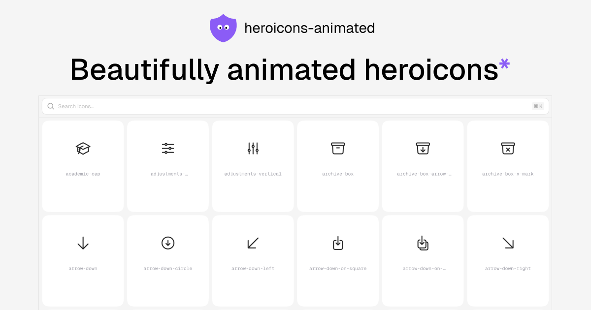

<a href="https://vercel.com/oss">
  
</a>
<br />

## `heroicons-animated` is beautifully animated heroicons.



**Demo** → [heroicons-animated](https://www.heroicons-animated.com)

**Sponsorship** → [heroicons-animated/sponsorship](https://github.com/sponsors/Aniket-508)

## Project Structure

```
heroicons-animated/
├── src/                    # Website
├── packages/
│   └── react/              # React package
```

## Installation

### Using shadcn CLI

```bash
pnpm dlx shadcn add @heroicons-animated/heart
```

### Using npm packages

```bash
pnpm add @heroicons-animated/react motion
```

```tsx
import { BeakerIcon } from "@heroicons-animated/react";

export default function App() {
  return (
    <>
      <BeakerIcon className="size-6" />
    </>
  );
}
```

## Star History

[](https://www.star-history.com/#Aniket-508/heroicons-animated&type=date&legend=top-left)

## Contributing

We welcome contributions to `heroicons-animated`! Please read our [contributing guidelines](CONTRIBUTING.md) on how to submit improvements and new icons.

## Credits

- Original project: [lucide-animated](https://lucide-animated.com/) by [@pqoqubbw](https://x.com/pqoqubbw)
- Heroicons: [heroicons.com](https://heroicons.com)

## License

This project is licensed under the MIT License - see the [LICENSE](LICENSE) file for details.

## Contact

If you have any questions or just want to say hi, feel free to reach out to me on X 👉 [@alaymanguy](https://x.com/alaymanguy).
